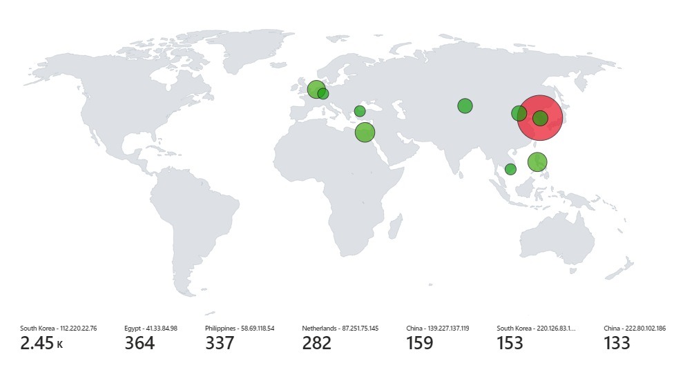

# Azure-SIEM-Project
An implementation of a real-time attack visualization system using Azure's SIEM solutions, specifically focusing on Microsoft Sentinel and Log Analytics. A setup within an Azure subscription, including the collection of logs from unsuccessful login attempts on a honeypot virtual machine, processing these logs through Log Analytics Workspace, and using Microsoft Sentinel for real-time attack visualization. This system leverages geolocation data from failed Remote Desktop Protocol (RDP) login attempts to visualize attacks on a map.

